# PROJECT REPORT
## FOUNDATIONS OF HIGH PERFORMANCE COMPUTING 2022-2023
### Guido Cera

## Table of Contents
0. [Introduction](#0-introduction)  
    0.1 [Game](#01-game)  
    0.2 [Orfeo](#02-orfeo)
    0.3 [Report structure](#03-report-structure)
1. [Methodology](#1-methodology)  
    1.1 [Static Evolution](#11-static-evolution)  
    1.2 [Ordered Evolution](#12-ordered-evolution)  
    1.3 [Multithreading](#13-multithreading)  
    1.4 [Multiprocessing](#14-multiprocessing)  
    1.5 [Board generation](#15-board-generation)  
    1.6 [Read and write image](#16-read-and-write-image)  
    1.7 [Time tracking](#17-time-tracking)  
    1.8 [Experimentation Environment](#18-experimentation-environment)  
    1.9 [Data collection](#19-data-collection)  
2. [Implementation](#2-implementation)  
    2.1 [Repository structure](#21-repository-structure)  
    2.2 [Data types](#22-data-types)  
    2.3 [Static Evolution](#23-static-evolution)  
    2.4 [Board generation](#24-board-generation)  
    2.5 [Check neighbours](#25-check-neighbours)   
    2.6 [Multiprocessing](#26-multiprocessing)  
3. [Results & Discussion](#3-results--discussion)  
    3.1 [OpenMP scalability](#31-openmp-scalability)  
    3.2 [Strong MPI scalability](#32-strong-mpi-scalability)  
    3.3 [Weak MPI scalability](#33-weak-mpi-scalability)  
4. [Conclusions](#4-conclusions)  
    4.1 [Simpler splitting of the grid](#41-simpler-splitting-of-the-grid)

## 0. Introduction
The project consists of a scaling study on a personal and highly parallel implementation of the so called Conway's Game of Life.

### 0.1 Game
Game of Life is played on a grid, where each cell can be either dead or alive. Starting with a grid in a state - with some cells alive and some dead - the grid "evolves", meaning each cell keeps or changes its state depending on the state of the neighbouring cells. The specific implementation for the evolution rules used in this project is presented in the assignment description ([github.com](https://github.com/Foundations-of-HPC/Foundations_of_HPC_2022/blob/main/Assignment/exercise1/)) and varies slightly from the classical rules of Conway's Game of Life. The grid is virtually infinite, the outer cells of the grid use the cells at the opposite site as neighbours; imagine that the grid multiplicates and each copy sits adjacent to the original in the same orientation. In a computer the cells have to be updated one by one and this offers multiple possibilities in how the cells are navigated and when they are updated; the two methods I implemented are called **ordered evolution** and **static evolution**. The former is preaphs the simplest both conceptually and in code, it is a loop over all cells in order and each is updated right away, before passing on to the next cell. The latter method holds the update of the cells after all cells have been checked and their next state have been decided. While in the ordered case the neighbours of a cell will be half in the old state and half in the new one, for the static evolution all neighours will be in the same state at the time of determining the new state of a cell.

Interesting fact, the classic implementation of Conway's Game of Life is Turin complete. ([Wikipedia](https://en.wikipedia.org/wiki/Conway%27s_Game_of_Life))

### 0.2 Orfeo
This project is being developed to run specifically on the high performance computer Orfeo located in Area Science Park, Trieste ([areasciencepark.it](https://www.areasciencepark.it/)). This is important for the parallelization of the code, which has to be built using the resources available on Orfeo ([ofeo-doc.areasciencepark.it](https://orfeo-doc.areasciencepark.it/)). Thus the code will contain an hybridization of MPI ([open-mpi.org](https://www.open-mpi.org/)) - for multiprocessing - and OpenMP ([openmp.org](https://www.openmp.org/)) - for multithreading.

### 0.3 Report structure
The general structure of the sections in this report adheres faithfully to the one suggested. The subsections in Methodology [[1.](#1-methodology)] and Implementation [[2.](#2-implementation)] often mimic each other. The different subsections with equal name cover the same topic but from a methodology standpoint if they are in section [[1.](#1-methodology)] and from an code implementation point of view if you found them in section [[2.](#2-implementation)]. To get a complete presentation on a topic check both sections.

## 1. Methodology
From an abstract point of view the core of the project - the Game of Life - is pretty straighfoward since it comprises of a matrix, some nested for loops and few simple checks to update the cells. I approached the project implementing this core structure first and then dwelving in the parallelization; and even if I have experience in multi-processing and multi-threading it felt like going from swimming in a pool to being thrown in the ocean during a storm. The most interesting choice of algorithm I encoutered at this stage was approacing the static evolution [[1.1](#11-static-evolution)]. Now, I do not want to give the impression that no optimization can be done, on the contrary, there are a great number of articles and book's chapters that analize the problem and make use of clever details of computer architecture or theory on sparce matrices and data structures in general to shrink dramatically the number of operations needed to play the game; here are some links to provide an overview of the optimization landscape for Game of Life.  
- ([stackoverflow.com](https://stackoverflow.com/questions/40485/optimizing-conways-game-of-life)) Post with some good answers and links to useful sources;
- ([docplayer.net](https://docplayer.net/20917679-Conway-s-game-of-life-makes-use-of-sparse-matrices.html)) Make use of theory on **sparce matrices**;
- ([jaregoy.com](https://www.jagregory.com/abrash-black-book/#chapter-17-the-game-of-life)) Michael Abrash’s Graphics Programming Black Book, chapter 17 spends 33 pages to optimize Game of Life;
- ([Wikipedia](https://en.wikipedia.org/wiki/Hashlife)) **Hashlife** is an algorithm that makes use of hash tables and reaches impressive speeds, with the drawback of occuping large amounts of memory
- ([dotat.at](https://dotat.at/prog/life/life.html)) An implementation of Game of Life which uses **bit-wise opterations** and **lookup tables**.

I want to stress the many possibilities of optimization since the philosopy of coding for an high performance computer is all about that, but one of the focuses of this course is parallelization, in particular through MPI and OpenMP, and the objective of this project is to show the scalability of multithreading and multiprocessing. In light of all this I decided to focus on implementing a good parallelization and I left a simple representation of the game underneath; which might actually help showing the power of multiprocessing when scaling.

The following subsections explore the coiches made in specific situations or show the methodological approach to specific subproblems.

### 1.1 Static Evolution
For this approach to evolution I need first to check all the cells and determine their next state and then, as a separate step, I can update the grid. This way the current state of the table is the only one used to update it. The problem resides in the computed next state, where do I put it while I check the following cells if I cannot use the grid itself? I need a way to store the next state until all cells have been checked and their next state computed. The way I store the next state needs also to be easily accessible and fast to read because as soon as I am done writing all next states there I will read them and transfer them to the actual grid.  
I saw two possible solutions to this problem, each with their own positives and negatives; one being to use middle-states to mark cells to modify and the other being to store two separate lists with the coordinates of cells to kill and to reviv. Follows an explanation and then an analisys of the two approaches in terms of memory needed, computational load and ease of use.
- **Middle-states.** With middle-states I mean adding states that a cell can be in other than "alive" and "dead". In particular I add the states "will die" to mark a cell that is alive but will have to die at the next evolution step, and "will live" to mark a cell that is dead but will live at the next evolution step. This approach consists of marking the cells directly on the grid, without any additional data structure, but in a way that still leaves visible the current state of the grid so that checking the following cells will not be influenced by the mark. The drawback of this approach presents itself at the moment of updating the grid for the next state, here I have to change all cells in a middle-state to the state they are meant to have. There are no shortcuts to accomplish this, an additional full scan of the grid is necessary to find the middle-states and write the corresponding final state.
- **Separate Lists.** Two separate dynamic lists store coordinates, one of the cells to revive and the other of the cells to kill. This approach uses additional memory but minimizes the effort to update the grid afterwards, since I only have to loop through the lists and access only the cells that need modifying and no other.  

From initial experiments I carried out I formed some expectations on the behaviour of this game. Unfortunately I did not save the precise numbers but my takeaway is that a significant number of cells change state each evolution step if we start from a random initial state [[2.4](#24-board-generation)]. Transalted to the two solutions above, this means that the lists will occupy a significant amount of memory each step, and if I update the memory allocated for each list doubling it when it is full I could have to allocate up to four times the size of the grid at each evolution step. Moreover middle-states are much easier to handle than dynamic memory. All this is why I opted for the middle-states soution instead of using separate lists. Further implementation details can be found in the next section [[2.3](#23-static-evolution)].

### 1.2 Ordered Evolution
The ordered evolution is simple in its implementation and does everything in a couple of nested loops; but this same simplicity is also reason reason of impairment for parallelization, and consequently scalability performance. Not all parallelization is impossible, multiprocessing works and is as effective as for the static evolution, only multithreading cannot bring any benefit and the reason is in the ordered nature of the approach and the way OpenMP parallelizes the work; let's analyze both in order. The ordered evolution is intrisically serial because when one cell gets updated its state will affect the other cells coming after that are around it. OpenMP handles multithreading of for loops assigning iterations to the threads, the assignment can be static or dynamic but in both cases a thread with its assigned iterations has to wait for all previous iterations to be done before he can execute its own. In the end, the whole computation is serial even if it is carried on multiple threads. For this reason I did not implement multithreading for this evolution. MPI implementation is the same for both evolutions and it is discussed in section [[1.4](#14-multiprocessing)].

### 1.3 Multithreading
I choose to focus my multithreading effort only on the heavyest part of the code, which is the evolution of the board itself. All other components that are neccessary but only function as a frame to the main part, even if they could exploit multithreading, I choose to leave single threaded. The reason for my choice was code clarity but most importantly it should not affect overall performance because all initializations and the set up for multiprocessing [[1.4](#14-multiprocessing)] is orders of magnitude faster than the evolution of the board. To cite one of the sources I linked above, Michael Abrash in his book Ghraphics Programming Black Book says this.

> The first rule of optimization is: Only optimize where it matters.

Where I did apply multithreading I tried to be strict with the data handling, all outside variables used inside the openMP area are explicitly marked and even the division policy I fixed the one which makes the most sense. 

### 1.4 Multiprocessing
As I anticipated above there is a little set up to do for MPI to work properly and efficently. Main reason being the need for explicit comunication between the processes which for Game of Life, at least as I implemented it, is very much essential; but let's start from the beginning and explain why there is this need. My reasoning is pretty simple, I have a grid that I need to split up in blocks to hand off one per process. So this I did, the grid gets divided in rectangles and each gets sent to a process. The rectangles are all of the same size, so that each process has the same workload. Here comes the comunication problem, the outer cells in a block have some of the neighbours in other blocks and thus in other processes, where they can no longer be accessed. Now I need to carefully propagate all outer cells of all blocks to the right corresponding blocks; top row, right coloumn, bottom row and left coloumn go respectiely to top block, right block, bottom block and left block, but the four cells in the corners also need to be sent to their respective block in diagonal of the origin block. All this propagation has to be done at each evolution step before updating the grid and before checking the neighbours.  
Last thing to consider for inter-process comunication is the need to save a snapshot of the grid during the evolution. When this necessity arises all blocks are gathered in the root process, the snap is saved and then the blocks are sent back each to the same process it came from, before finally proceding with the evolution.

There are many operations that need to be computed by a single process, I picked the root process to execute them. Picking the root process specifically ensures that the program will run even if launched with only one process.

### 1.5 Board generation
The assignment requires a mode where a grid gets generated given its dimensions but there is no indication as what the state of this grid should be, so here is what I did. The simplest solution would be to return an image of the requested size with always the same initial state. This would be possible since the minimum size of the grid is 100x100, the requirement would be for the state to be contained in this limit, and all the extra space could be all dead cells. What I did instead is generating a random state eache time. Generated the image I iterate through it and with a probability of 0.2 a cell gets marked as alive.

Generating a new grid is one of the tasks my program executes with only one process, but I implemented multithreading since in inizialization mode creating a new grid is all the program does. Multithreading brings a problem with the random number generation that I discuss in section [[2.4](#24-board-generation)].

To create a different seed for each grid instead of going all fancy with the `time.h` library I implemented a little seed generator using the string containing the name to give the final file. This works on the assumptions that the name of the image would contain some information about the size of the grid and there is no need to generate different grids of the same size. Since I am the only user of this code I can assure that these assumptions are met.   

### 1.6 Read and write image
I will not comment on any function in the file `read_write_pgm_image.c` since I did not personally write it. I just used the functions in there, hopefully the way they were inteded to.

### 1.7 Time tracking
I used three different timers to gather data on the execution. The first, most general, timer I call "whole evolution timer" because it starts after the initial set up of reading the external parameters, reading the image and initializing MPI and just before launching the evolution. This timer ends just after
the evolution. A second timer is all inside the evolution function but still times the whole evolution and is outside all evolution loops. Compared to the first timer it excludes the division of the grid into blocks [[1.4](#14-multiprocessing)]. The third and final timer is actually a measure of average time; the average time to propagate the outer cells of the blocks between processes. I decided to implement the last one because I was worried that it would take a significat portion of the execution; turns out I was wrong as you can see in the results section [[3](#3-results--discussion)]. 

### 1.8 Experimentation Environment
At the time I executed my program and got the tests results Orfeo was pretty busy all the time with, I guess, other students doing their own projects. I had a little hope I could run more tests than the strictly necessary but in the end I did not manage to. I ran all tests on EPYC nodes, I only touched THIN nodes for the second exercise. More over I only used OpenMPI and never IntelMPI. I do not have much to say about this because these were not choices I made but rather constraints I found myself in.

### 1.9 Data collection
I automated the data gathering process to make it easier to generate plots and such for this report and also to check as soon as a test finishes if the data it created makes sense in relation to the previous data. 

## 2. Implementation
### 2.1 Repository structure
A list of all relevant files and folders in the repository
        exercise_1
            include
                gol.h
            obj
            snapshots
            src
                evolution_parallel.c
                evolution.c
                read_write_pgm_image.c
                utilities.c
            starts
            data.csv
            main.c
            Makefile
            report.pdf
where,
- `exercise_1` contains all files relevant to the Game of Life assingment
    - `include` constains the personal library
        - `gol.h` is the library to link the functions in the `.c` files
    - `obj` is a folder that stores the object file when the program gets compiled
    - `snapshots` is the folder where the snapshots of the grid get saved during execution
    - `src` is the folder with the program files
        - `evolution_parallel.c` final evolution file with evolution functions and check neighbours function, all parallelized.
        - `evolution.c` first iteration of evolution, no parallelization
        - `read_write_pgm_image.c` contains functions to read and write pgm images
        - `utilities.c` here you can find all the auxiliary functions used by the core of the program
    - `starts` is the folder that contains starting images
    - `data.csv` is the file where I stored the results of the tests
    - `main.c` is the main of the program
    - `Makefile` is the Makefile for the program
    - `report.pdf` this file you are reading! 

### 2.2 Data types
The matrix that stores the grid, and also all auxiliary variables and arrays that store cells, are of type `unsigned char`. Firstable `char` is the type that occupies the least memory in C at 1 Byte, which is plenty to store the numbers from 0 to 255 that the grid uses. Secondable since, as just noted, the numbers to be stored are all positive using `usigned` provides an hardcoded guard against negative values; this way the code better resembles the logic behind it.  

  
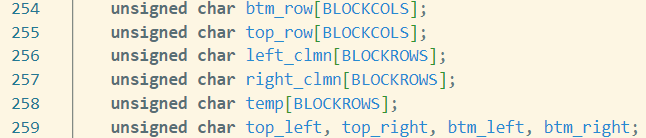   

*From `evolution_parallel.c`, use of `unsigned char`*

### 2.3 Static Evolution
The implementation of static evolution is quite long, mostly because of MPI parallelization. 

---

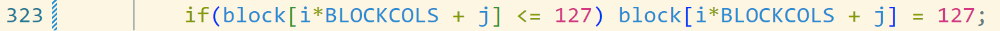

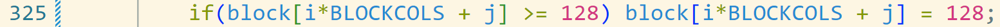

*From `evolution_parallel.c`, middle-states and checking the current state*

---

In section [[1.1](#11-static-evolution)] I explained the theory behind the middle-states, it is here the place to see them in action. The states are `0` for "dead" and `255` for "alive", the middle-states are `127` for "will live" and `128` for "will die". Realistically any number between one and 127 would have sufficed for "will live" state and analogously any number between 128 and 254 would have worked. The important fact about the middle-states is that they still enable checking for the current state of the cell with one single operation, as shown in the image above. If a cell contains a number greater or equal than 128 then it is currently alive. If a cell contains a number lower or equal than 127 then it is currently dead. Important to note is that these middle-states never leave the evolution loops, at the end of the second loop, the one to update the grid to the new state, all cells will have either `0` or `255` as values. When it is time to save a snapshot no middle-states will be present in the grid. 

### 2.4 Board generation
In generating the board I explained in section [[1.5](#15-board-generation)] the random approach I took, now I will present an interesting problem I encountered with `srand` and OpenMP.

---

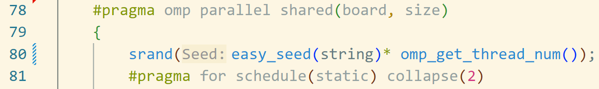

*From `utilities.c`, `srand` and OpenMP conflict*

---

The problem is not apparent in the code but it wil appear looking at the images generated, what happens is that each thread has the same seed. The image shows a pattern that repeats itself for the number of threads used. The image below is taken from a blog post that helped me greatly in solving the problem, it lays out the problem in a very clear way and offers a clever solution. Already present in the code above the solution is to use the thread number which is unique for each thread, to modify the seed, now all seeds will be different and no patterns will emerge.  

---

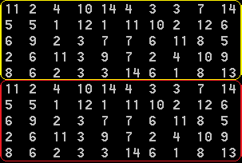

*From a blog post ([pvs-studio.com](https://pvs-studio.com/en/blog/posts/0012/)), the pattern in the matrix*

---

This problem is not really critical since the images would have worked even with the repetitions and I could have simply removed the multithreading to solve the problem, but I think it is worth mentioning.

### 2.5 Check neighbours
This function checks the neighbours of a cell and returns `1` if the cell has to live at the next evolution step, `0` otherwise. The way the propagated cells are handled greatly influences how simple this function is to implement. I though of two possible ways to manage the propagated cells, follows a presentation of both with an explanation of what would change for `check_neighbours`.

- **New block.** One option is to allocare a new, larger, block to accomodate for the two additional rows and coloumns that were sent from other processes. Then passed this array to `check_neighbours` it is only a matter of looping through an hard-coded array of off-sets (see figure below) to visit all neighbours because they are already all around the cell.

- **Disjointed arrays.** The opposite approach is to leave all arrays as they are and pass them singularly to `check_neighbours` which will have to handle them with ad-hoc code. Each outer row and outher coloumn needs its own lines of code, but the corners need special treatment as well, in total there are eight different possibilities; nine if we consider that a cell might just be not on the edge of the block, then the previous method with the hard-coded array of off-sets can still apply. This last case is actually the most frequent for blocks of a certain size, and it gets more frequent as size increases. Nevertheless the edge cases (pun intened) have to be handled and to do so a lot of boring, error-prone and difficult-to-mantain lines of code are necessary.

All things considered I picked the second option. The problem with the new block is the new block itself, which uses memory. The amount of memory space used by the program would basically double because a whole new grid (more actually because the new block is slightly bigger) would have to be allocated, and memory allocation also takes time. I repeated already more than once that propagation is not relevant for perfomance but when it comes to inter-nodes process comunication the orders of magnitude of difference between strictly evolution time and propagation time are not that many, so disregarding efficency altogether is not advisible.

---

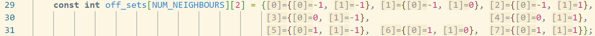

*From `evolution_parallel.c`, hard-coded array of off-sets*

---
---

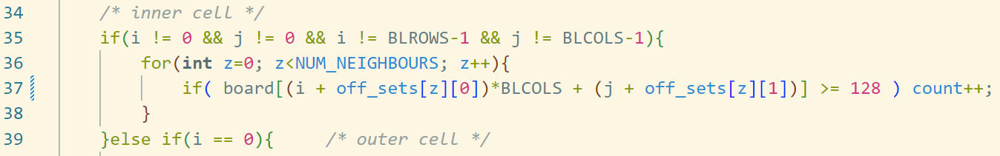

*From `evolution_parallel.c`, code to check neighbours for an inner cell*

---
---

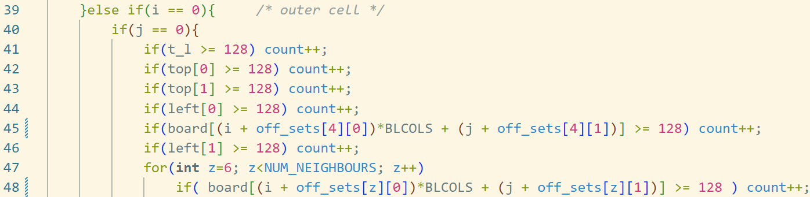

*From `evolution_parallel.c`, code to check neighbours for the upper left cell in the block*

---

### 2.6 Multiprocessing
I took inspiration for implementing the splitting of the grid from a stackoverflow post about this very topic ([stackoverflow.com](https://stackoverflow.com/questions/7549316/mpi-partition-matrix-into-blocks)). I used the answer in the post to check that I used correctly  `MPI_Scatterv` to send the blocks to their respective processes. 

---

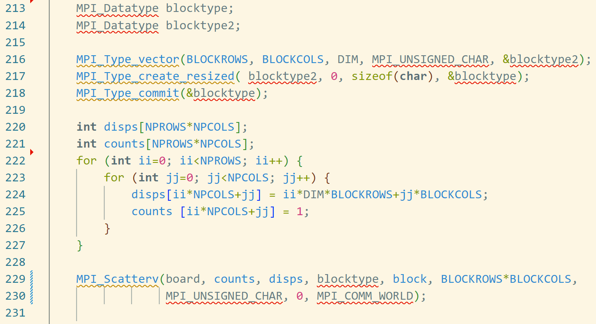

*From `evolution_parallel.c`, splitting of the grid*

---

In the code above there is the code pertaining to `MPI_Scatterv`. The use of `MPI_Scatterv` instead of `MPI_Scatter` is really essential even if it is not apparent from the code. The difference between the two functions is that my variable `counts` which specifies the number of elements to send to each processor, is an array in `MPI_Scatterv` while it is only a single variable in the base version. As you can see my `counts` has all ones when passed to the function so one might think that the base version would have sufficed. I though the same but upon making the change I discovered that now the blocks were not sent in order to the processes anymore. Before, with `MPI_Scatterv`, if you numbered the block from zero and proceeded by row each block would have exactly the rank of the process it would end up in. This ordering of the blocks is of vital importance because it later allows the use of `MPI_Gather` to reconstitute the grid on one process and save a snapshot. So `MPI_Scatterv` is very important for this implementation.  
Another piece of code to mention from the image above are the very first rows shown, from `213` to `218`. The variable `blocktype` is a kind of wrapper and represents the type of a block in the grid. This is also taken from the stackoverflow post. 

Note that all considerations for splitting the grid are valid both for the ordered evolution and the static.

---

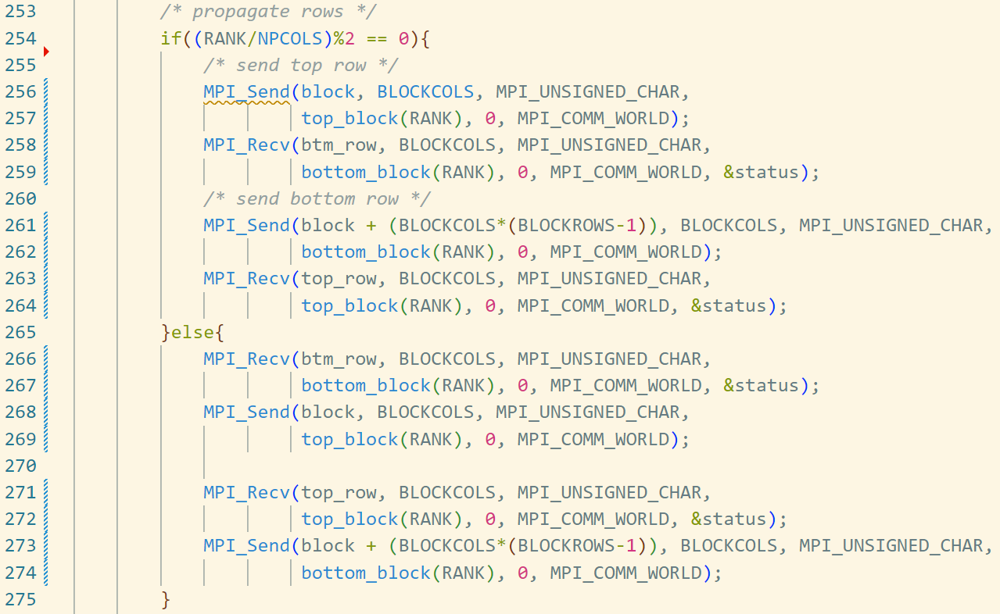

*From `evolution_parallel.c`, propagation of outer cells*

---

This is only a portion of the whole propagation code and it specifically refers to the propagation of the top and bottom rows of all blocks. It is sufficent to demonstrate the logic of `MPI_Send` and `MPI_Recv`. Both functions require the ranks of the sender process and the reciving process, for this I wrote `top_block` and `bottom_block` which, given the rank of the current process, return the rank of the process managing respectively the upper and lower block. Below you can see the implementation of `top_block` as an example, it does an efficent check of the position of the block and subsequently executes the right formula to get the desired block.  
The outer `if` condition ensures that a deadlock is never encountered; it divides the processes, and consequently the blocks, by row. All blocks in an even row will enter the `if` block and the others will execute the `else` block. The difference between the two blocks is only in the order of execution of sends and receives, even rows will execute the send first and odd rows will do the opposite. This prevents deadlocks because a block in an even row will send to blocks in an odd row and they on the other hand, will be ready to receive. Then the roles reverse and in the end both blocks will have the row they need. The same concept applies to the outer coloumns and the four cells at the corners. 

---

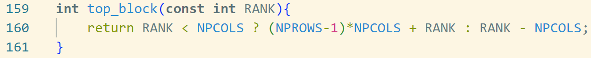

*From `evolution_parallel.c`, top_block function, `NPCOLS` and `NPROWS` variables are global and represent the number of blocks per coloumn and per row respectively*

---

One last thing to mention about the propagation is that I could have saved space and made the code slimmer by using a matrix to store all the data from other blocks and grouping up the sends and receives into one big send and one big receive. Additionally I would have problably also gained a little performance by doing this. The reason I did not follow this route is that the logic of sends and receives is not immediate to me and laying out every single operation has been a good exercise in parallelization mentality. As per the performance claim I already anticipated how the propagation is not the main drag, so in this aspect it is not a real concern.

### 2.7 Multithreading
Since I choose a simple approach to the Game of Life all the heavy computation is inside for loops, nested for loops to be precise. 
Since each iteration carries out almost the same amount of computation - check neighbours, if the state has to be changed, change it - there is no need to dynamically assing the iterations to the threads, I can save on the overhead and assign statically. The computational differences between iterations depend on the state of the neighbours which determine if the state of the cell has to be changed or not. The checks for the neighbours are equal to all iterations, what can change is how many times the counter of alive neighbours gets increased. But all things considered the possible difference in load is at most nine write operations (eight neighbours plus the cell itself), which is really not a big number.

## 3. Results & Discussion
for all tests:
- commands of allocated resources
- commands for running experiment
- data plots
- explanation

### 3.1 OpenMP scalability

        salloc -N1 -p EPYC -n128 --time=1:0:0
        export OMP_PLACES=cores
        srun -n1 --cpus-per-task=64 mpirun --map-by socket gol.x -r -f start_1000px.pgm -n 1000 -e 1 -s 1000
size,steps,evolution,"processor number","thread number","total time","evolution time","average propagation time"
1000,1000,1,1,1,72635616,72632154,7
1000,1000,1,1,2,36536630,36534854,7
1000,1000,1,1,4,18318647,18317337,7
1000,1000,1,1,8,9218737,9217823,15
1000,1000,1,1,16,4652385,4651514,19
1000,1000,1,1,32,2367646,2366288,21
1000,1000,1,1,64,1302963,1300866,24

### 3.2 Strong MPI scalability

### 3.3 Weak MPI scalability

## 4. Conclusions 

### 4.1 Simpler splitting of the grid
The simplest method for splitting the grid would be to assign to each process groups of `n` rows or coloumns, depending on which is major, where `n` is the result of the size of the matrix divided by the number of processes. This approach has the same number of cells to propagate as the one implemented but is simpler because they are all grouped in only two rows. There would be no need for external coloumns propagation.